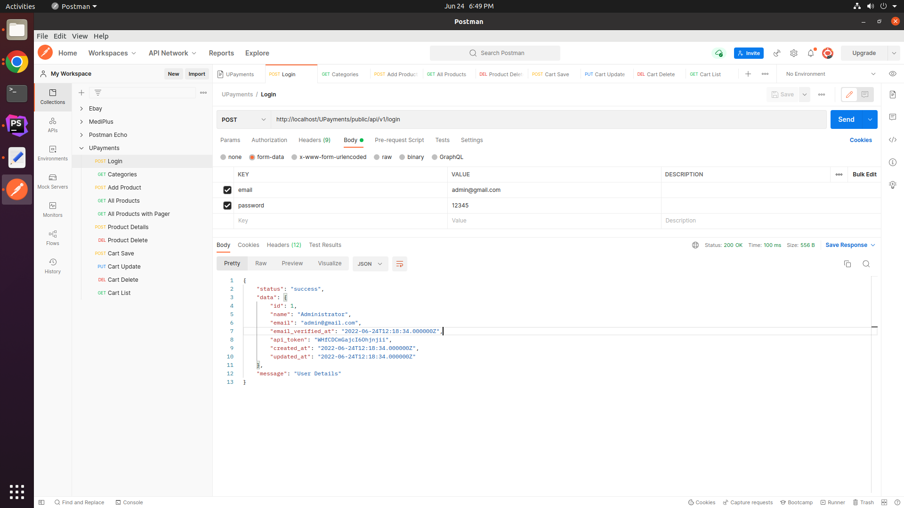
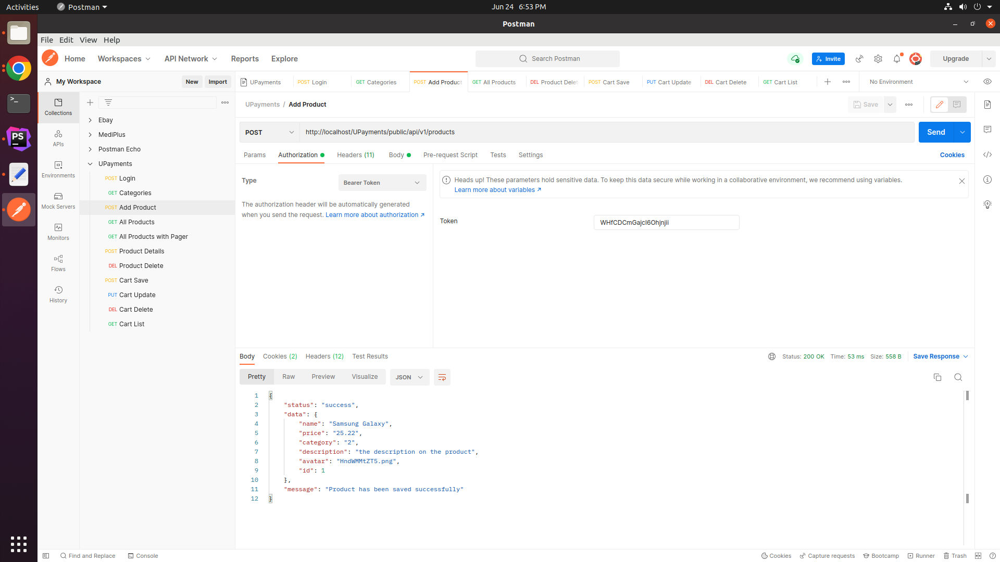
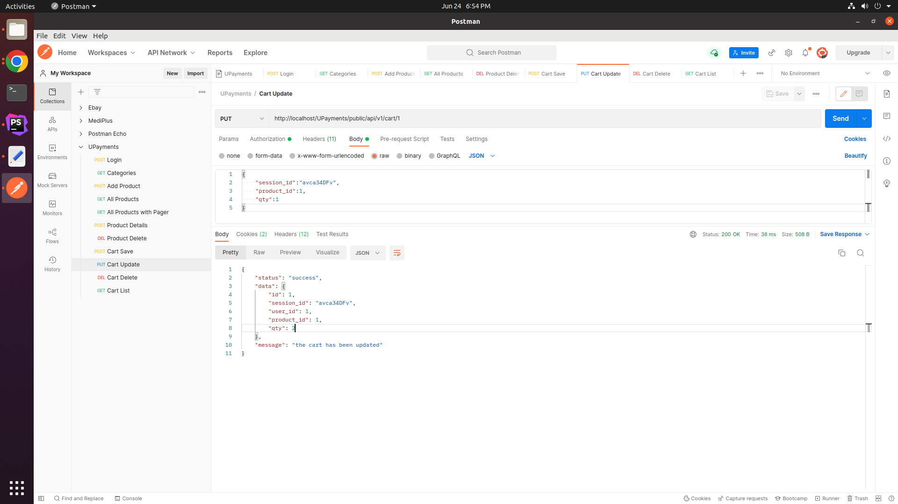

## Installation
- create a database and import the sql file located at Documentation folder
- open .env file in the root and change the mysql database connection settings

## Documentation
- find the postman api collection at Documentation folder and import it to postman
- file the web documentation for api details [https://documenter.getpostman.com/view/4942578/UzBqpRLp](https://documenter.getpostman.com/view/4942578/UzBqpRLp)

## Screenshots

